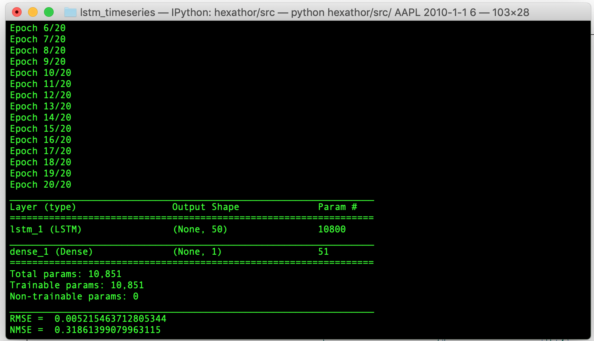

# LSTM RNN for one-step ahead predictions




```
python hexathor/src/ 'AAPL' 2010-1-1 6

RMSE =  0.005215463712805344
NMSE =  0.31861399079963115

usage: [-h] ticker date smooth

LSTM RNN for Time Series Forecasting

positional arguments:
  ticker      Ticker name from Yahoo!Finance
  date        Fetch data from: yyyy,m,d
  smooth      Number of times for centered moving average
 ```
